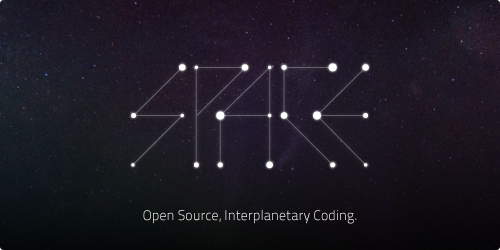

 

SpaceIDE
--------
A rewrite of the awesome chaoscollective's Space Editor
> Source is messy, will eat your cat!

How to run?
-----------
Currently this IDE is unter development, so things will don't work correctly
To run dev server execute this commands:
> Clone repo
> Install latest nightly of node.js (Use nvs)
> Install deps (npm install)
> Run (node webpack/webpack.config.server.js)

Libraries/Platforms used:
-------------------------
 - Node.JS
 - Potato.Socket
    - UWS
    - ProtoDef
 - XPress
 - Webpack
 - Reach (Inferno in production)
 

Roadmap:
--------
 - [ ] Frontend
     - [X] Finish panel layout
        - [X] Synchronize with mobx (model)
     - [ ] Add panels
        - [X] Code editor panel (Based on ace.js)
            - [X] Fix resizing (Use global state)
        - [ ] Alternative code editor panel?
            - Because monaco editor is very good
        - [ ] Preview panel 
            - [ ] Finish u-preview
        - [ ] Terminal panel
        - [ ] Log panel
            - [ ] Rewrite u-logger from meteor.js to react
            - [ ] Opensource u-logger
            - [ ] Find the way to embed u-logger
                - Iframe? (Ugly way)
                - API?
                - Make u-logger a part of SpaceIDE?
        - [ ] Chat panel
            - [ ] Add LR split between project view and chat panel
            - [ ] Styles
                - [X] Normal message
                - [ ] Status message
                - [ ] Service message
                - [ ] Idea message
            - [ ] Mobx connection
            - [ ] Text
            - [ ] Voice
                - [ ] Finish Potato.RTC
                    - [X] Find the way WebRTC is not works outside of Google Chrome
            - [X] Standalone
            - [X] Toggle button (While not in chat)
     - [X] Finish styles
        - [X] Rewrite to less
     - [X] IDE
        - [X] Add IDE level top menu
     - [X] Notifications
        - [X] Notification log
            - [X] Toggle button
 - [ ] Finish collaboration on backend 
 - [X] Create Potato.Socket component for React
 - [X] Fix mobx-dev-tool (Two last buttons)
 - [ ] Authorization
    - [ ] Finish uauth-server
        - [ ] Finish vue.js ui
            - [X] UI
            - [ ] Interactivity
        - [ ] Host on bluemix (uauth.f6cf.pw)
    - [ ] Finish uauth-client
        - [ ] Opensource uauth client
 - [X] Webpack config
    - [X] Protodef loader
    - [X] CSS Modules
 - [X] Operational transformations
 - [ ] Move to typescript
    - Later?
 - [ ] Backend
 - [X] Fix paths