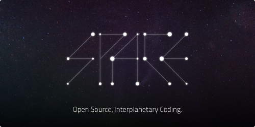

 

SpaceIDE
--------
A rewrite of the awesome chaoscollective's Space Editor
> Source is messy, will eat your cat!

Libraries/Platforms used:
-------------------------
 - Node.JS
 - Potato.Socket
    - UWS
    - ProtoDef
 - XPress
 - Webpack
 - Reach (Inferno in production)
 - Ot.JS (For collaboration)
 

Roadmap:
--------
 - [ ] Finish panel layout
 - [ ] Add panels
    - [ ] Code editor panel (Based on ace.js + ot.js)
    - [ ] Preview panel 
        - [ ] Finish u-preview
    - [ ] Terminal panel
    - [ ] Log panel
        - [ ] Rewrite u-logger from meteor.js to react
        - [ ] Opensource u-logger
        - [ ] Find the way to embed u-logger
            - Iframe? (Ugly way)
            - API?
            - Make u-logger a part of SpaceIDE?
 - [ ] Chat panel
    - [ ] Add LR split between project view and chat panel
    - [ ] Styles
        - [X] Normal message
        - [ ] Status message
        - [ ] Service message
        - [ ] Idea message
    - [ ] Mobx connection
    - [ ] Text
    - [ ] Voice
        - [ ] Finish Potato.RTC
            - Find the way WebRTC is not works outside of Google Chrome
    - [X] Standalone
    - [X] Toggle button (While not in chat)
 - [ ] Finish collaboration on backend 
 - [ ] Create Potato.Socket component for React
 - [ ] Finish styles
    - [X] Rewrite to less
 - [ ] Notifications
    - [X] Notification log
        - [X] Toggle button
    - [ ] Notification types
 - [X] IDE
    - [X] Add IDE level top menu
 - [ ] Fix mobx-dev-tool (Two last buttons)
 - [ ] Authorization
    - [ ] Finish uauth-server
        - [ ] Finish vue.js ui
            - [X] UI
            - [ ] Interactivity
        - [ ] Host on bluemix (uauth.f6cf.pw)
    - [ ] Finish uauth-client
        - [ ] Opensource uauth client